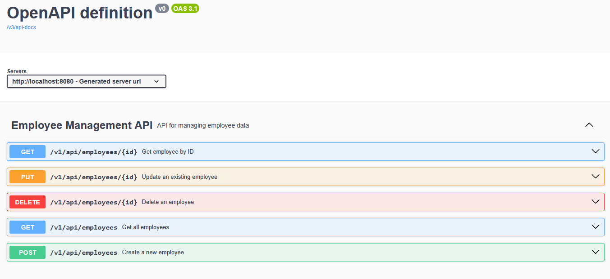

Here's an updated `README.md` file tailored to your actual project structure, PostgreSQL configuration, and the article you're writing about Exception Handling and Swagger. It includes setup instructions, database configuration, and a clear link to the companion article.

Simply replace your current `README.md` with the content below.

```markdown
# Spring Boot API Best Practices: Exception Handling & Swagger

[](https://adoptium.net/)
[](https://spring.io/projects/spring-boot)
[](https://www.postgresql.org/)
[](LICENSE)

## 📌 Overview

This repository is a **production‑ready reference implementation** of a RESTful API built with Spring Boot. It focuses on two essential skills for Java backend developers:

- **Global Exception Handling** – Consistent, structured error responses using `@RestControllerAdvice`.
- **Interactive API Documentation** – Auto‑generated Swagger UI via SpringDoc OpenAPI.

The project accompanies a detailed technical article that explains **why** these patterns matter and **how** to implement them correctly.

> 📖 **Read the Full Article:**  
> *"Building Interview‑Ready REST APIs: Exception Handling and Swagger Documentation in Spring Boot"*  
> *(Link coming soon – check back!)*

## 🧩 Project Structure

```
    src/
    ├── main/
    │   ├── java/com/shehan/workflow_service/
    │   │   ├── controller/        # REST endpoints with Swagger annotations
    │   │   ├── dto/               # Data Transfer Objects (EmployeeDto)
    │   │   ├── exception/         # Custom exceptions & GlobalExceptionHandler
    │   │   ├── mapper/            # Entity ↔ DTO mapping logic
    │   │   ├── model/             # JPA entities (Employee)
    │   │   ├── repository/        # Spring Data JPA interfaces
    │   │   ├── service/           # Business logic layer
    │   │   └── WorkflowServiceApplication.java
    │   └── resources/
    │       ├── application.yml    # Configuration (DB, JPA, SpringDoc)
    │       ├── static/
    │       └── templates/
    └── test/                      # Unit and integration tests
    ```

## 🛠 Tech Stack

| Technology | Purpose |
|------------|---------|
| **Java 17** | Core language |
| **Spring Boot 3.4.0** | Application framework |
| **Spring Data JPA** | Database abstraction |
| **PostgreSQL** | Relational database |
| **SpringDoc OpenAPI 2.6.0** | Swagger UI & OpenAPI spec generation |
| **Maven** | Build & dependency management |

## ⚙️ Getting Started

### Prerequisites
- JDK 17 or later
- Maven 3.6+
- PostgreSQL (running on `localhost:5432`)

### Database Setup
Create a database named `ems` in PostgreSQL:
```sql
CREATE DATABASE ems;
```
The application will auto‑create tables using `spring.jpa.hibernate.ddl-auto=update`.

### Configuration
The main configuration is in `src/main/resources/application.yml`:
```yaml
spring:
  application:
    name: workflow-service
  datasource:
    url: jdbc:postgresql://localhost:5432/ems
    username: (your username)
    password: (your pw)
  jpa:
    hibernate:
      ddl-auto: update
    show-sql: true
    properties:
      hibernate:
        format_sql: true
        dialect: org.hibernate.dialect.PostgreSQLDialect

springdoc:
  api-docs:
    path: /api-docs
  swagger-ui:
    path: /swagger-ui.html
```

> ⚠️ **Security Note:** In a real production environment, credentials should be externalised using environment variables (e.g., `${DB_USERNAME}`). This example uses plain text for local development simplicity.

### Run the Application
```bash
# Clone the repository
git clone https://github.com/ShehanDev/spring-boot-api-best-practices.git
cd spring-boot-api-best-practices

# Build and run
./mvnw spring-boot:run
```
The server will start at `http://localhost:8080`.

## 📖 API Documentation (Swagger)

Once the app is running, access the interactive API docs at:

🔗 **[http://localhost:8080/swagger-ui/index.html](http://localhost:8080/swagger-ui/index.html)**

You can also get the raw OpenAPI JSON:
- `http://localhost:8080/api-docs`



## 📝 Article Highlights

This repository demonstrates the concepts covered in the accompanying article:

### 1. Global Exception Handling
- Custom exceptions like `EmployeeNotFoundException`.
- `@RestControllerAdvice` with `@ExceptionHandler` to return structured `ErrorResponse` JSON.
- Mapping exceptions to appropriate HTTP status codes.

### 2. Swagger / OpenAPI Documentation
- `@Operation` and `@ApiResponses` annotations on controller methods.
- Custom API info (title, description, contact) via `springdoc` properties.
- Documented error responses (e.g., `404 Not Found`, `400 Bad Request`).

### 3. DTO Pattern & Validation
- `EmployeeDto` separates API contract from the JPA entity.
- Jakarta Bean Validation (`@NotNull`, `@Email`, etc.) ensures data integrity.

## 🧪 Sample API Calls

### Create an Employee
```bash
curl -X POST http://localhost:8080/v1/api/employees \
  -H "Content-Type: application/json" \
  -d '{
    "firstName": "John",
    "lastName": "Doe",
    "email": "john.doe@example.com"
  }'
```

### Get All Employees
```bash
curl -X GET http://localhost:8080/v1/api/employees
```

### Trigger a 404 Error
```bash
curl -X GET http://localhost:8080/v1/api/employees/9999
```
**Response:**
```json
{
  "timestamp": "2026-04-15T12:00:00",
  "status": 404,
  "error": "Not Found",
  "message": "Employee not found with id: 9999",
  "path": "/v1/api/employees/9999"
}
```

## 🎯 Why This Project Matters 

- **Clean Architecture:** Separation of concerns (Controller → Service → Repository).
- **Production Mindset:** Proper error handling and API documentation.
- **Industry Tools:** Demonstrates experience with Spring Boot, JPA, PostgreSQL, and Swagger.
- **Interview Readiness:** Common interview questions often revolve around exception handling and REST best practices.

## 📄 License

This project is licensed under the MIT License – see the [LICENSE](LICENSE) file for details.

## 👤 Author

**Shehan Dev**  
[GitHub](https://github.com/ShehanDev) | [LinkedIn](http://www.linkedin.com/in//shehan-mallawaarachchi/fr) *(update link)*

---

⭐ If you found this helpful, please consider starring the repository!